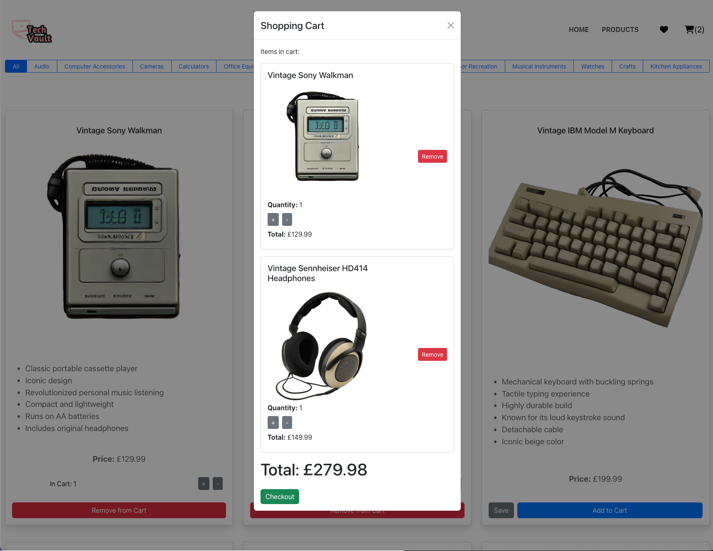
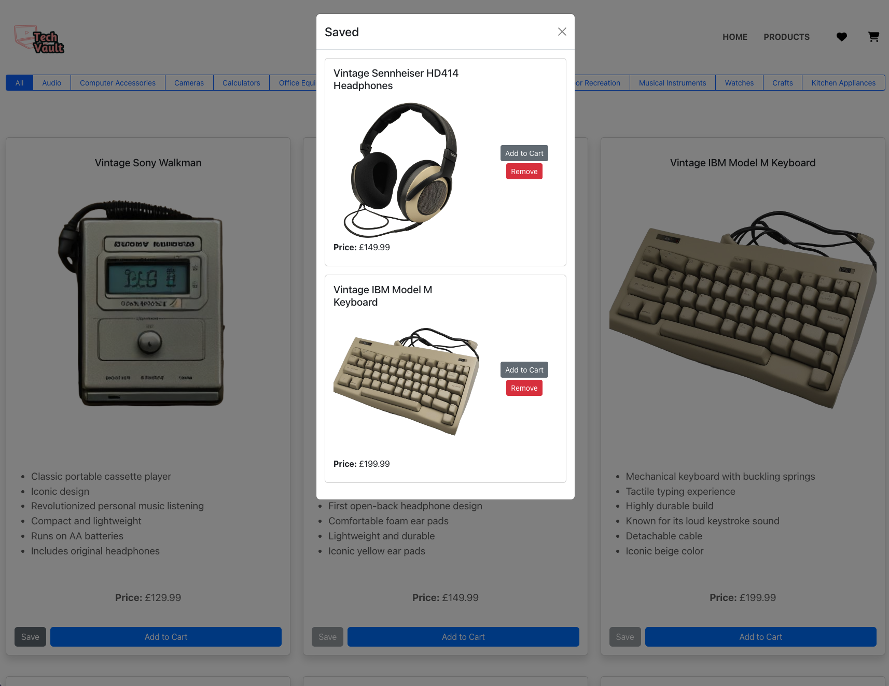

# Tech Vault Ecommerce

## 📝 **Description**

Tech Vault is an Ecommerce website dedicated to selling rare vintage tech products. This platform offers a curated selection of iconic gaming systems, timeless computing devices, and retro gadgets at unbeatable prices.

**Motivation:**
The motivation behind building Tech Vault stemmed from the desire to gain practical, hands-on experience with React, enhancing theoretical knowledge through real-world application. The project also aimed to understand and implement efficient state management, optimize application performance, and create a visually appealing and user-friendly shopping experience.

**Problem Solved:**
Tech Vault solves the problem of finding rare and luxury vintage tech products by providing a dedicated platform with a carefully curated selection, ensuring quality and authenticity for tech enthusiasts and collectors.

**Learnings:**
Throughout the development of Tech Vault, the following key skills and knowledge areas were reinforced:

- Structuring and managing complex applications using React's component-based architecture.
- Implementing state management using React hooks such as useState, useEffect, useReducer, and Context API.
- Optimising application performance with code splitting and routing.
- Designing and styling a responsive and engaging user interface using CSS-in-JS and React Bootstrap.

## 🗂️ **Table of Contents**

- [Installation](#installation)
- [Usage](#usage)
- [License](#license)

## 💻 **Installation**

To install and set up Tech Vault locally, follow these steps:

1. **Clone the repository:**
   ```bash
   git clone https://github.com/yourusername/tech-vault-ecommerce.git
   ```
2. **Navigate to the project directory:**
   ```bash
   cd tech-vault-ecommerce
   ```
3. **Install dependencies:**
   ```bash
   npm install
   ```
4. **Start the development server:**
   ```bash
   npm start
   ```
5. Open your browser and visit `http://localhost:3000` to see the application in action.

## 🚀 **Usage**

To use Tech Vault, follow these steps:

1. **Browse Products:**
   - Navigate through different categories to explore the curated selection of vintage tech products.
2. **View Product Details:**

   - Click on a product to view detailed information, including descriptions, specifications, and pricing.

3. **Add to Cart:**

   - Add desired products to your shopping cart for purchase.

4. **Add to Saved:**

   - Add desired products to your Saved to watch the item(s).

   ```md
   
   ```

   ```md
   
   ```

## 🪪 **License**

 — (<Project-Title> is covered under MIT License.)

## ❔**How to Contribute**

Any queries about this project, please feel welcome to reach out to me using the following credentials:

<h3>Josh Capito</h3>
- LinkedIn: <a href="https://linkedin.com/joshuaecapito">Joshua Capito</a>
<br />
- Email: <a href="mailto:joshuaecapito22@gmail.com">Contact via Email</a>
